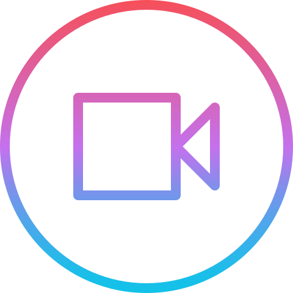

<!-- PROJECT SHIELDS -->
<!--
*** I'm using markdown "reference style" links for readability.
*** Reference links are enclosed in brackets [ ] instead of parentheses ( ).
*** See the bottom of this document for the declaration of the reference variables
*** for contributors-url, forks-url, etc.
-->
 

  [![Contributors][contributors-shield]][contributors-url]
  [![Forks][forks-shield]][forks-url]
  [![Stargazers][stars-shield]][stars-url]
  [![Issues][issues-shield]][issues-url]
  [![MIT License][license-shield]][license-url]

 

  

  <h3 align="center">Tundra Player</h3>

  

    This is a Video player made with electron, react and material-ui.
     
     
    <a href="https://github.com/edumudu/tundra-player/issues">
      Report Bug
    </a>
    ·
    <a href="https://github.com/edumudu/tundra-player/issues">
      Request Feature
    </a>
  

## About The Project

 

![App Screenshot][product-screenshot]

The project aims to create a video player as complete as possible, mainly for linux, but it is also good to have it running on other OS.

Any suggestions, criticism or help is welcome. Please see the [contribution guide](CONTRIBUTING.md).

### Video Supported formats

- mp4
- webm
- ogg

### Built With

- [Typescript](https://www.typescriptlang.org/)
- [Node](https://nodejs.org/en/)
- [Electron](https://www.electronjs.org/)
- [React](https://reactjs.org/)
- [Material Ui](https://material-ui.com/)

## Roadmap

See the [open issues](https://github.com/edumudu/tundra-player/issues) for a list of proposed features (and known issues).

## Autor

Made with ❤️ by Eduardo Wesley

## LICENSE

This project is under MIT licence. See the archive [LICENSE](LICENSE) to more details.

---
<small>
  

    Icon made by <a href="https://www.flaticon.com/br/autores/iconixar" title="iconixar">iconixar</a> from <a href="https://www.flaticon.com/br/" title="Flaticon">www.flaticon.com</a>
  

</small>

<!-- MARKDOWN LINKS & IMAGES -->
<!-- https://www.markdownguide.org/basic-syntax/#reference-style-links -->
[contributors-shield]: https://img.shields.io/github/contributors/edumudu/tundra-player?style=flat-square
[contributors-url]: https://github.com/edumudu/tundra-player/graphs/contributors

[forks-shield]: https://img.shields.io/github/forks/edumudu/tundra-player?style=flat-square
[forks-url]: https://github.com/edumudu/tundra-player/network/members

[stars-shield]: https://img.shields.io/github/stars/edumudu/tundra-player?style=flat-square
[stars-url]: https://github.com/edumudu/tundra-player/stargazers

[issues-shield]: https://img.shields.io/github/issues-raw/edumudu/tundra-player?style=flat-square
[issues-url]: https://github.com/edumudu/tundra-player/issues

[license-shield]: https://img.shields.io/github/license/edumudu/tundra-player?style=flat-square
[license-url]: https://github.com/edumudu/tundra-player/blob/master/LICENSE

[product-screenshot]: docs/images/app_screenshot.png
